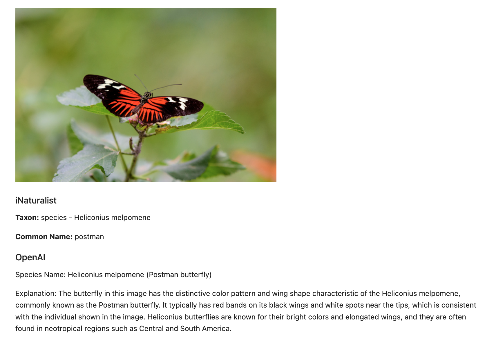
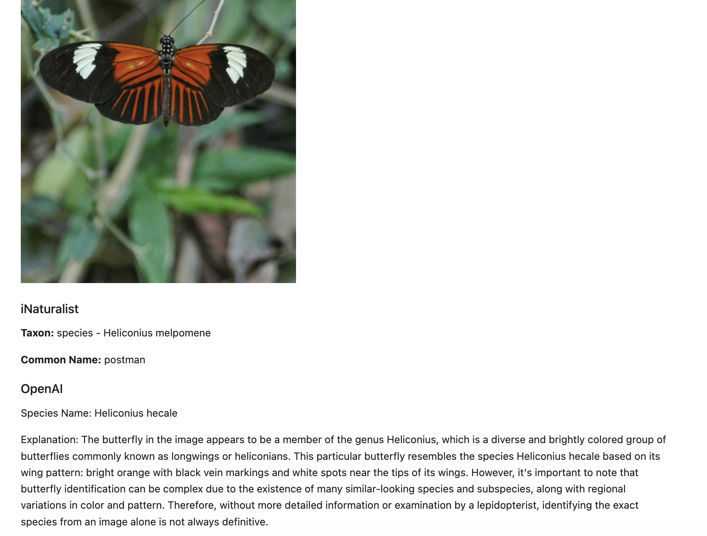
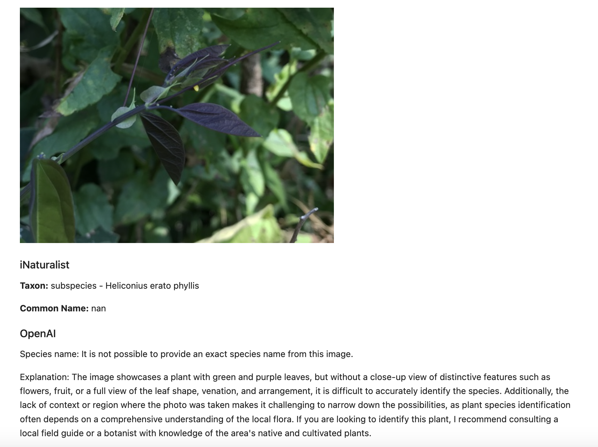

# iNaturalist vs OpenAI
[Butterfly-GPT-4V-Test notebook](Butterfly-GPT-4V-Test.ipynb) compares species names determined by the [OpenAI gpt-4-vision-preview model](https://platform.openai.com/docs/guides/vision) against data from [iNaturalist](https://www.inaturalist.org/). 
The notebook fetches observations (images) from iNaturalist by fetching 10 images for two species names: 'Heliconius melpomene' and 'Heliconius erato'.
The images are used with the OpenAI API and a prompt to determine a species name for each observation.

## Results
The complete results are visible in the notebook.
The OpenAI results seem pretty good, but were not consistent between runs.
This inconsistency is expected since the notebook uses the default OpenAI `temperature`.

### Matching Species Example 


### Mismatched Species Example


### iNaturalist "Misidentified" Species Example
One of the [observations included two images](https://www.inaturalist.org/observations/14803608).
The first image was of a plant without the butterfly. The second was the plant with the butterfly.
The notebook only used the first image and the model predicted a plant.


## Preview Model Limitations
The model being used is a preview so only 100 requests are allowed per day.
When this limit is exceeded the following error occurs:
```
RateLimitError: Error code: 429 - {'error': {
  'message': 'Rate limit reached for gpt-4-vision-preview in ... on requests per day (RPD): Limit 100,...}}                                          
```

## Usage
It is recommended to run the notebook within a virtual environment.
To run the notebook 
- install the requirements
- set an environment variable with your OpenAI key
- open jupyter lab
- open the notebook
- choose Run -> Run All Cells
```console
pip install -r requirements.txt
export OPEN_API_KEY=sk...
jupyter lab
```
